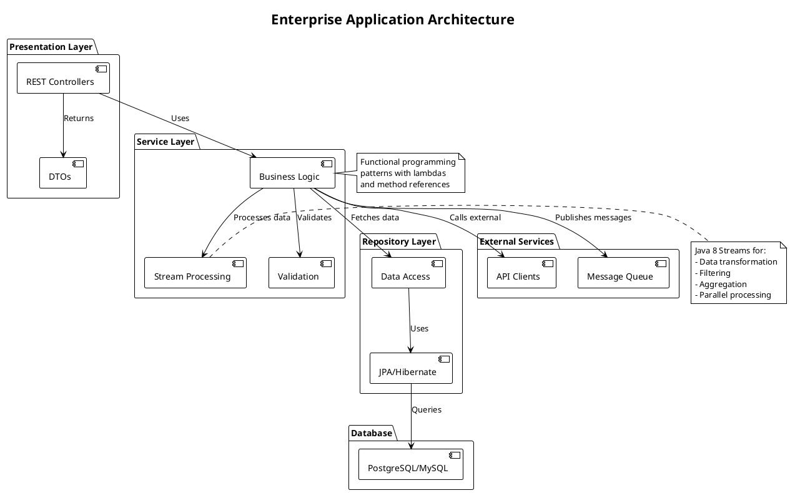
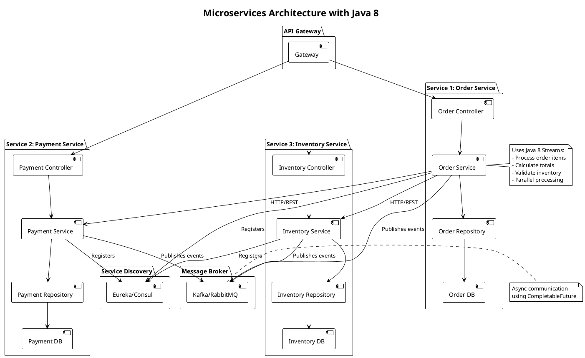
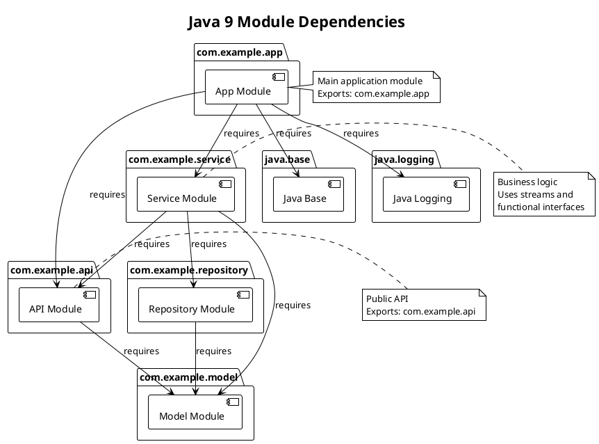
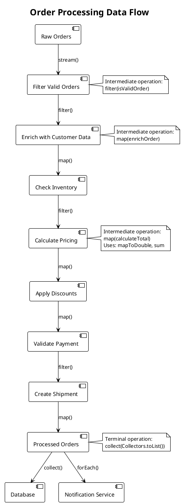
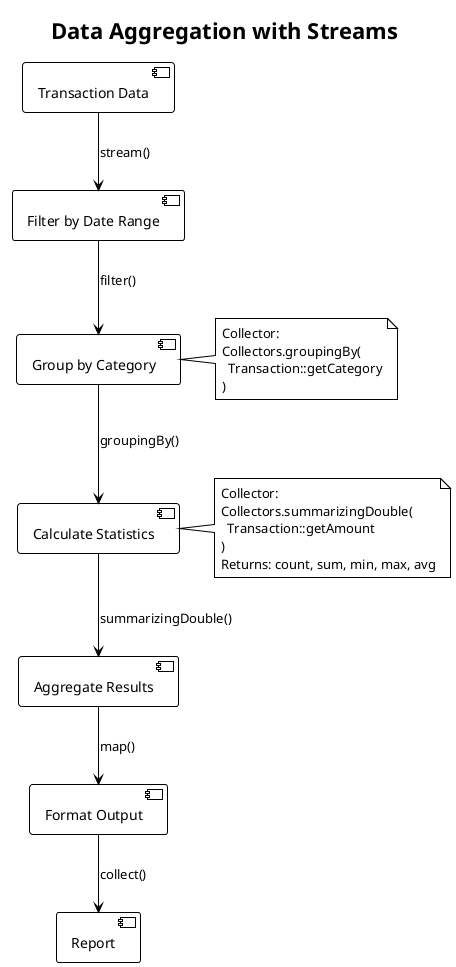
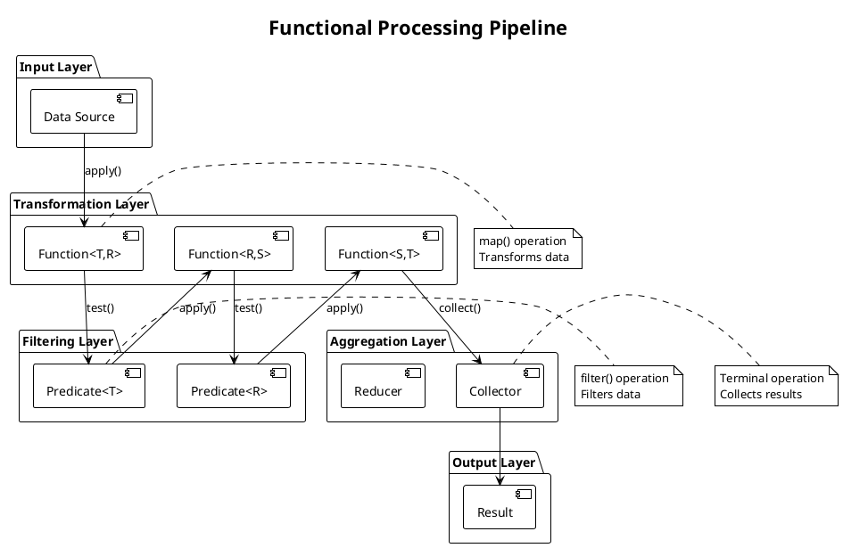
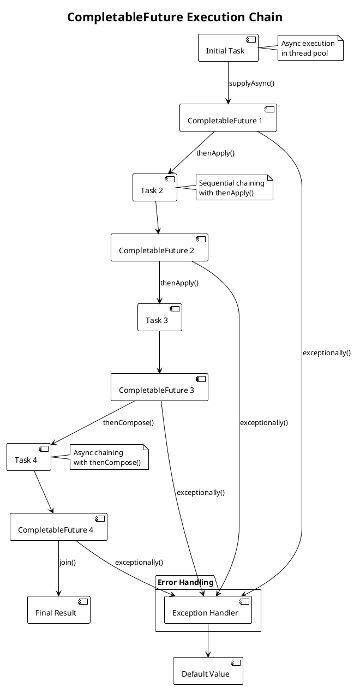
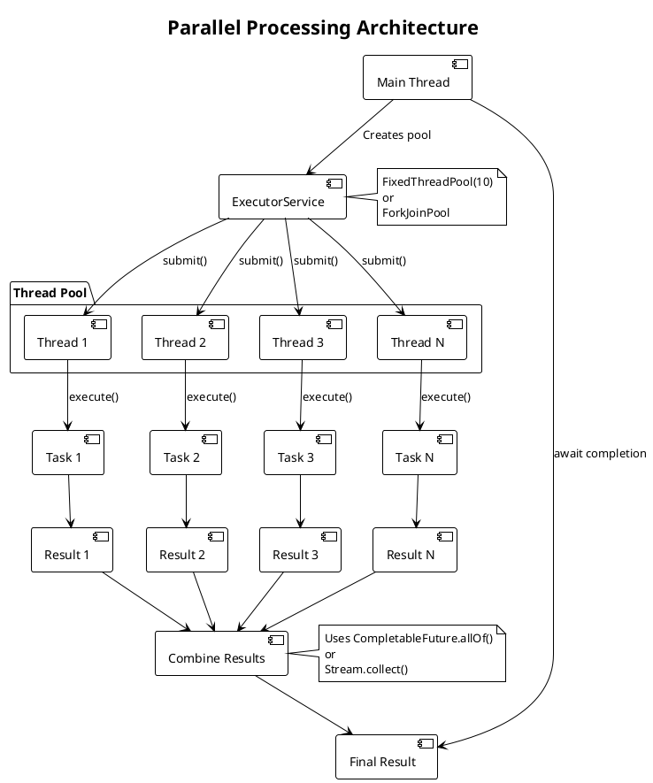
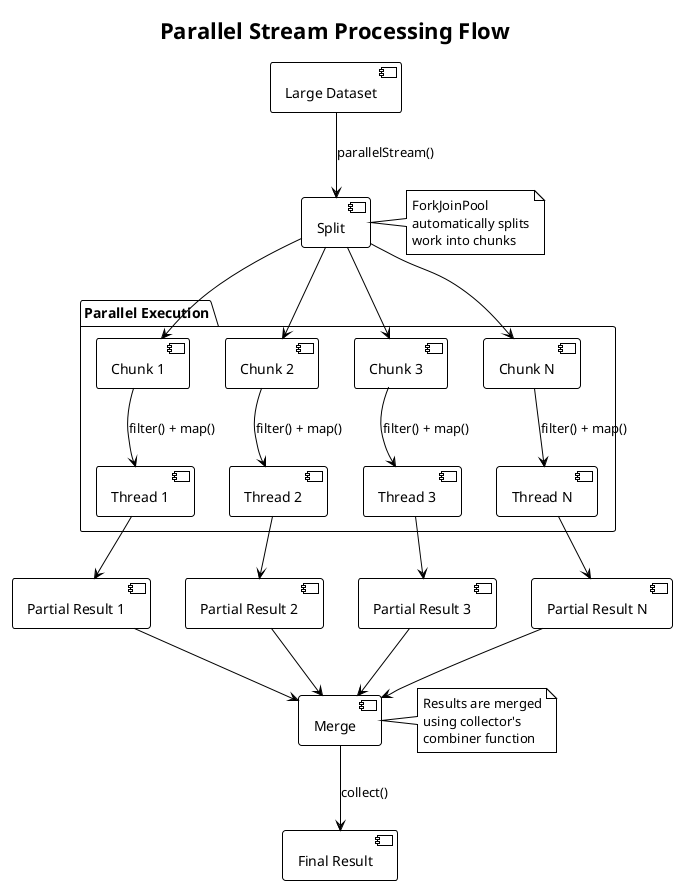

# Architecture Diagrams - PlantUML

> **Visual representations of Java 8+ concepts, patterns, and enterprise architectures**

---

## Table of Contents

1. [Stream Processing Flow](#stream-processing-flow)
2. [Enterprise Application Architecture](#enterprise-application-architecture)
3. [Module Dependencies](#module-dependencies)
4. [Data Flow Patterns](#data-flow-patterns)
5. [Functional Pipeline Architecture](#functional-pipeline-architecture)
6. [Concurrency Patterns](#concurrency-patterns)

---

## Stream Processing Flow

### Basic Stream Pipeline

```plantuml
@startuml Stream Pipeline
!theme plain
skinparam backgroundColor #FFFFFF

title Stream Processing Pipeline

package "Source" {
    [Collection/Array] as Source
}

package "Intermediate Operations" {
    [filter()] as Filter
    [map()] as Map
    [flatMap()] as FlatMap
    [distinct()] as Distinct
    [sorted()] as Sorted
    [limit()] as Limit
}

package "Terminal Operations" {
    [collect()] as Collect
    [forEach()] as ForEach
    [reduce()] as Reduce
    [findFirst()] as FindFirst
}

package "Result" {
    [Collection/Value] as Result
}

Source --> Filter : stream()
Filter --> Map : filter()
Map --> FlatMap : map()
FlatMap --> Distinct : flatMap()
Distinct --> Sorted : distinct()
Sorted --> Limit : sorted()
Limit --> Collect : limit()
Collect --> Result : collect()

note right of Source
  Collections, Arrays,
  Stream.of(), etc.
end note

note right of Filter
  Lazy evaluation:
  Operations execute
  only when terminal
  operation is called
end note

note right of Collect
  Terminal operation:
  Triggers execution
  of entire pipeline
end note

@enduml
```

### Stream with Parallel Processing

```plantuml
@startuml Parallel Stream
!theme plain
skinparam backgroundColor #FFFFFF

title Parallel Stream Processing

package "Source" {
    [Large Collection] as Source
}

Source --> [Split into Chunks] : parallelStream()

package "Parallel Processing" {
    [Thread 1\nChunk 1] as T1
    [Thread 2\nChunk 2] as T2
    [Thread 3\nChunk 3] as T3
    [Thread N\nChunk N] as TN
}

[Split into Chunks] --> T1
[Split into Chunks] --> T2
[Split into Chunks] --> T3
[Split into Chunks] --> TN

T1 --> [Intermediate\nOperations]
T2 --> [Intermediate\nOperations]
T3 --> [Intermediate\nOperations]
TN --> [Intermediate\nOperations]

[Intermediate\nOperations] --> [Combine Results]
[Combine Results] --> [Final Result]

note right of Source
  Large datasets
  (millions of elements)
end note

note right of [Split into Chunks]
  ForkJoinPool
  splits work
end note

note right of [Combine Results]
  Results are combined
  in order (if needed)
end note

@enduml
```

---

## Enterprise Application Architecture

### Layered Architecture with Java 8



### Microservices Architecture



---

## Module Dependencies

### Java 9 Module System



---

## Data Flow Patterns

### Order Processing Pipeline



### Data Aggregation Flow



---

## Functional Pipeline Architecture

### Functional Processing Pipeline



### Strategy Pattern with Functional Interfaces

```plantuml
@startuml Strategy Pattern
!theme plain
skinparam backgroundColor #FFFFFF

title Strategy Pattern using Functional Interfaces

package "Context" {
    [PaymentProcessor] as Processor
}

package "Strategies" {
    [Function<Double, PaymentResult>] as Strategy
}

package "Concrete Strategies" {
    [CreditCardPayment] as CreditCard
    [PayPalPayment] as PayPal
    [BankTransferPayment] as BankTransfer
}

package "Client" {
    [Order Service] as Client
}

Client --> Processor : process(paymentMethod, amount)
Processor --> Strategy : apply(amount)
Strategy --> CreditCard : if "CREDIT_CARD"
Strategy --> PayPal : if "PAYPAL"
Strategy --> BankTransfer : if "BANK_TRANSFER"

CreditCard --> [Payment Result]
PayPal --> [Payment Result]
BankTransfer --> [Payment Result]

note right of Processor
  Uses Map<String, Function<Double, PaymentResult>>
  to store strategies
end note

note right of Strategy
  Functional interface
  replaces traditional
  strategy classes
end note

@enduml
```

---

## Concurrency Patterns

### CompletableFuture Chain



### Parallel Processing with ExecutorService



### Stream Processing with Parallel Execution



---

## Component Interaction

### Service Layer with Streams

```plantuml
@startuml Service Layer
!theme plain
skinparam backgroundColor #FFFFFF

title Service Layer Component Interaction

package "Controller" {
    [REST Controller] as Controller
}

package "Service Layer" {
    [Order Service] as OrderService
    [Validation Service] as ValidationService
    [Pricing Service] as PricingService
    [Notification Service] as NotificationService
}

package "Repository Layer" {
    [Order Repository] as OrderRepo
    [Customer Repository] as CustomerRepo
    [Product Repository] as ProductRepo
}

package "External Services" {
    [Payment Gateway] as PaymentGateway
    [Shipping Service] as ShippingService
}

Controller --> OrderService : createOrder(orderDTO)

OrderService --> ValidationService : validate(order)
ValidationService --> OrderService : isValid

OrderService --> OrderRepo : findById()
OrderService --> CustomerRepo : findById()
OrderService --> ProductRepo : findAllById()

OrderService --> PricingService : calculateTotal(order)
PricingService --> OrderService : total

OrderService --> PaymentGateway : processPayment()
PaymentGateway --> OrderService : paymentResult

OrderService --> ShippingService : createShipment()
ShippingService --> OrderService : shipmentId

OrderService --> NotificationService : sendNotification()
NotificationService --> OrderService : sent

OrderService --> OrderRepo : save(order)

note right of OrderService
  Uses Java 8 Streams:
  - Process order items
  - Filter valid items
  - Calculate totals
  - Group by category
  - Parallel processing
end note

note right of PricingService
  Functional pipeline:
  items.stream()
    .map(calculateItemPrice)
    .reduce(sum)
end note

@enduml
```

---

## Summary

These PlantUML diagrams illustrate:

1. **Stream Processing**: How data flows through stream pipelines
2. **Enterprise Architecture**: Layered and microservices patterns
3. **Module Dependencies**: Java 9+ module system
4. **Data Flow**: Real-world processing patterns
5. **Functional Pipelines**: Functional programming patterns
6. **Concurrency**: Parallel processing and async execution

**How to Use:**

1. Install PlantUML plugin in your IDE or use online editor
2. Copy diagram code into `.puml` file
3. Generate diagrams for documentation
4. Use in presentations and architecture documents

**Tools:**
- [PlantUML Online](http://www.plantuml.com/plantuml/uml/)
- IntelliJ IDEA: PlantUML plugin
- VS Code: PlantUML extension
- Maven/Gradle: PlantUML plugin

---

**Visual learning helps understand complex concepts! 📊**
